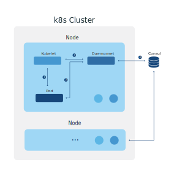

# katalog-sync [](https://godoc.org/github.com/wish/katalog-sync) [](https://travis-ci.org/wish/katalog-sync)  [](https://goreportcard.com/report/github.com/wish/katalog-sync)  [](https://quay.io/repository/wish/katalog-sync)

katalog-sync is a node-local mechanism for syncing k8s pods to consul services.

katalog-sync has:

- node-local syncing to local consul-agent
- agent-services in consul, meaning health of those endpoints is tied to the node agent
- sync readiness state from k8s as check to consul
- (optional) sidecar service to ensure consul registration before a pod is marked "ready"

katalog-sync makes the following assumptions:

- You have a consul-agent running on each node (presumably as a Daemonset)
- You are running a consul-agent which supports ServiceMetadata (>= [1.0.7](https://www.hashicorp.com/blog/consul-1-0-7))
- You want to sync Pods to consul services and have the readiness values reflected
- Your pods can communicate with Daemonsets running on the same node

### katalog-sync overview


1. Kubelet starts container on Node
1. (optional) katalog-sync-sidecar calls to katalog-sync-daemonset waiting until registration with consul is complete
1. Daemonset syncs changes from kubelet through the local kubelet API
1. Daemonset syncs changes to consul

### k8s pod annotations
| Annotation                                        |                                                  |
|---------------------------------------------------|--------------------------------------------------|
| katalog-sync.wish.com/service-names               | Comma-separated list of service names            |
| katalog-sync.wish.com/service-port                | Port for the consul service                      |
| katalog-sync.wish.com/service-port-**SERVICE-NAME** | Port override to use for a specific service name |
| katalog-sync.wish.com/service-tags                | Tags for the consul service                      |
| katalog-sync.wish.com/service-tags-**SERVICE-NAME**  | Tags override to use for a specific service name |
| katalog-sync.wish.com/service-meta                | ServiceMeta for the consul service                      |
| katalog-sync.wish.com/service-meta-**SERVICE-NAME**  | ServiceMeta override to use for a specific service name |
| katalog-sync.wish.com/sidecar                     | Container name of the katalog-sync-sidecar       |
| katalog-sync.wish.com/sync-interval               | How frequently to sync this service with consul  |
| katalog-sync.wish.com/service-check-ttl           | TTL for the service checks put into consul       |
| katalog-sync.wish.com/container-exclude           | Comma-separated list of containers to exclude in readiness check |

### katalog-sync-daemon options
``` console
$ ./katalog-sync-daemon  -h
Usage:
  katalog-sync-daemon [OPTIONS]

Application Options:
      --log-level=                        Log level (default: info) [$LOG_LEVEL]
      --bind-address=                     address for binding RPC interface for
                                          sidecar [$BIND_ADDRESS]
      --pprof-bind-address=               address for binding pprof
                                          [$PPROF_BIND_ADDRESS]
      --min-sync-interval=                minimum duration allowed for sync
                                          (default: 500ms) [$MIN_SYNC_INTERVAL]
      --max-sync-interval=                maximum duration allowed for sync
                                          (default: 5s) [$MAX_SYNC_INTERVAL]
      --default-sync-interval=
      --default-check-ttl=
      --sync-ttl-buffer-duration=         how much time to ensure is between
                                          sync time and ttl (default: 10s)
                                          [$SYNC_TTL_BUFFER_DURATION]
      --kubelet-api=                      kubelet API endpoint (default:
                                          http://localhost:10255/pods)
                                          [$KUBELET_API]
      --kubelet-api-insecure-skip-verify  skip verification of TLS certificate
                                          from kubelet API
                                          [$KUBELET_API_INSECURE_SKIP_VERIFY]

Help Options:
  -h, --help                              Show this help message
```

### katalog-sync-sidecar options
``` console
$ ./katalog-sync-sidecar -h
Usage:
  katalog-sync-sidecar [OPTIONS]

Application Options:
      --log-level=                       Log level (default: info) [$LOG_LEVEL]
      --katalog-sync-daemon=             katalog-sync-daemon API endpoint [$KATALOG_SYNC_DAEMON]
      --katalog-sync-daemon-max-backoff= katalog-sync-daemon API max backoff (default: 1s) [$KATALOG_SYNC_DAEMON_MAX_BACKOFF]
      --bind-address=                    address for binding checks to [$BIND_ADDRESS]
      --namespace=                       k8s namespace this is running in [$NAMESPACE]
      --pod-name=                        k8s pod this is running in [$POD_NAME]
      --container-name=                  k8s container this is running in [$CONTAINER_NAME]

Help Options:
  -h, --help                             Show this help message
```
